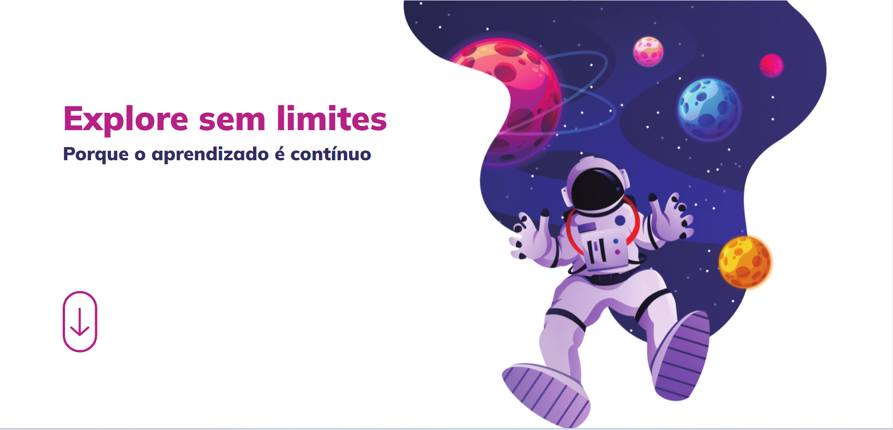

<h1 align="center"> Explore sem limites! </h1>

Projeto responsivo e com animação promovido pela rocketseat para ensino de tecnologias WEB.

  <a href="#-tecnologias">Tecnologias</a>&nbsp;&nbsp;&nbsp;|&nbsp;&nbsp;&nbsp;
  <a href="#-projeto">Projeto</a>&nbsp;&nbsp;&nbsp;|&nbsp;&nbsp;&nbsp;
  <a href="#-layout">Layout</a>&nbsp;&nbsp;&nbsp;|&nbsp;&nbsp;&nbsp;
  <a href="#memo-licença">Licença</a>

  

 

  

[🔗 Clique aqui para acessar](https://devleuuon.github.io/explorerWithOutLimits/)

## 🚀 Tecnologias

Esse projeto foi desenvolvido com as seguintes tecnologias:

- HTML e CSS
- Git e Github
- Figma

## 💻 Projeto

Projeto responsivo e com animação para melhorar a prática e os conhecimentos.

## 🔖 Layout
Você pode visualizar o layout do projeto através [DESSE LINK](https://www.figma.com/file/YGzs2wBL1oQJ07z1zk67YH/Explore-sem-limites-(Copy)?node-id=15%3A37973&mode=dev) para acessá-lo.

## 📝 Licença

Esse projeto está sob a licença MIT.